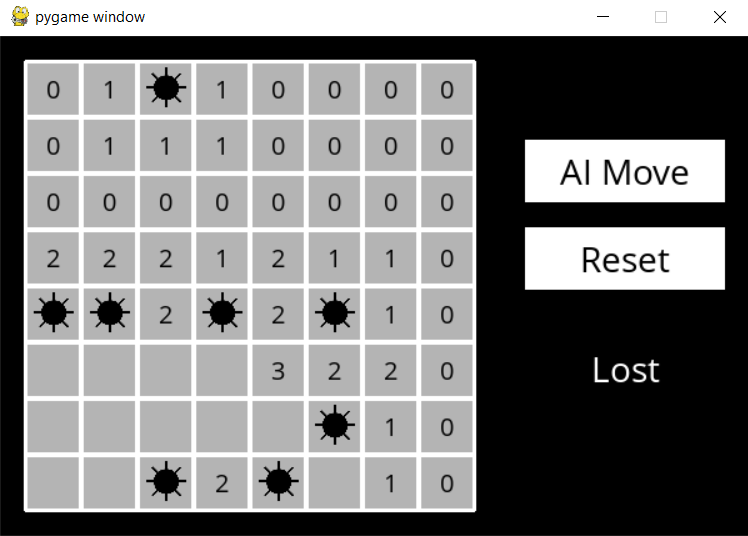

# Minesweeper

### Description
This is an AI powered minesweeper in which you can yourself play the game and you can also let AI play the game.  
It is basically based on the prepositional logic and knowledge base.
***
### game layout

***
### Play Screenshots


***
### How to Run:
```Bash
python runner.py
```
***
### Requirements:
```Bash
pip3 install pygame
```
or just use the following command
```Bash
pip3 install -r requirements.txt
```
